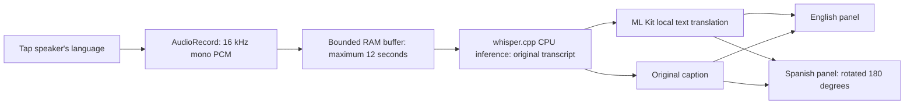

# Architecture and boundaries

## Scheduling and cancellation

`MainActivity` owns two single-thread executors: microphone capture and inference/setup. Whisper contexts must not be used concurrently. Opening, decoding, and releasing occur on the inference executor. UI cancellation calls a native atomic abort flag; freeing waits behind the active native call.

`ConversationLedger` assigns a generation (epoch) to each turn. Clear, backgrounding, and returning to setup increment it. Recognition and translation updates from an older epoch are rejected, including completions that arrive after a new conversation starts. Both panels render the same immutable turn snapshots with opposite language priorities.

The capture loop has a fixed sample capacity. It stops after 12 seconds or when the speaker finishes. Unused frame data and managed PCM arrays are cleared on completion or failure. Near-silence and sub-half-second input skip inference. These checks are conservative input filters, not voice activity detection.

Original text is retained when translation fails, and the receiving panel shows a failure state. There is no remote inference fallback or hidden substitution of a sample answer. Sample layout mode is labelled and never starts microphone capture.

## Provisioning

The speech model is imported through Android's document picker into the app's private no-backup storage. A bounded streaming copy verifies the published upstream SHA-1 for the original multilingual tiny or base file, and `AtomicFile` preserves the old import if replacement fails. This checksum identifies the upstream file; it is not a modern security signature. Native load independently rejects incompatible models.

ML Kit manages its own local Spanish translation model and clients. An explicit action in the setup flavor downloads required data, then checks English→Spanish and Spanish→English on fixed, nonsensitive phrases. Ordinary conversation processing never invokes `downloadModelIfNeeded`.

The offline flavor uses the same application ID and signing key as setup so an in-place update can preserve both model stores. It removes network permissions from the merged manifest, including dependency declarations. The permission-inspection script must check the built artifact. The update/preservation workflow is designed but remains untested on hardware.

## Privacy

- No app code writes audio, transcripts, conversation databases, or diagnostic text containing conversation content. No third-party crash reporter or analytics package is added.
- The history is bounded to 12 turns. Leaving the foreground immediately clears displayed history and invalidates processing. Android saved-instance state does not include conversation data.
- `FLAG_SECURE` blocks normal screenshots and recent-app previews. It does not prevent someone nearby from reading the phone or establish facility permission.
- Native Whisper/ggml logging is disabled, including realtime transcript printing. Raw PCM stays in memory.
- The offline APK has no `INTERNET` permission for its app UID. This does not control unrelated system services or other apps.
- Clearing references and wiping selected PCM arrays is not forensic memory erasure. Java strings, decoder state, native scratch buffers, and the OS can retain memory until reuse. Model files are retained for future visits; conversation files are never intentionally created.
- The setup APK has internet permission. ML Kit is proprietary and may send SDK operational metadata during setup; review Google's current SDK data-disclosure/terms documentation before broader distribution. No inference request containing the user's transcript is issued by our code.

## Known gaps

No automatic sentence segmentation, continuous/VAD mode, speaker diarization, text correction, TTS, model deletion UI, calibrated confidence, Bluetooth recording selection, or session export. The device test plan covers the basic pilot before any of those additions. Legal/medical interpreting and emergencies require more reliable arrangements than an unvalidated prototype.
